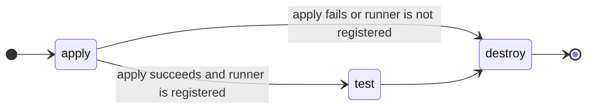

# End-To-End Tests

The end-to-end tests are run in CI for every backstage code change.
The modules defined in `/e2e` use the GRIT modules to create and register runner managers against GitLab.com.

We use `u${CI_PIPELINE_ID}-${E2E_TEST_NAME}` as a unique name for the registered runner
and to name infrastructure.
This ensures resources are unique to the pipeline, can be created in parallel
and can be traced back to the pipeline.

## Pipelines

For each end-to-end test we create a [child pipeline](https://docs.gitlab.com/ee/ci/pipelines/downstream_pipelines.html#parent-child-pipelines)
with the following structure:

Child pipelines have the advantage of configuration reuse and can be re-run in their entirety in the case that a job fails.

The trigger jobs for the end-to-end tests are defined in [`40_e2e.gitlab-ci.yml`](../gitlab/ci/40_e2e.gitlab-ci.yml).
The generic child pipeline is defined in [`e2e-pipeline.gitlab-ci.yml`](../gitlab/ci/e2e-pipeline.gitlab-ci.yml).

The test jobs currently just curl the metadata endpoints of the created instance.
This could be extended to do more validation of the environment.

## Debugging

It is often preferable to debug the tests using the CI pipeline
as a feedback loop, especially as all the environment variables are present.

To work locally you should set up your environment as defined in the
[integration tests](../CONTRIBUTING.md#integration-tests).

Additionally you should export `TF_` environment variables as defined
in the [`e2e-pipeline.gitlab-ci.yml`](../gitlab/ci/e2e-pipeline.gitlab-ci.yml),
specifically:

- `TF_HTTP_*` variables for the http backend configuration.
- `TF_VAR_runner_tag` to uniquely identify the created runner.
- `TF_VAR_name` to unique identify the infrastructure.
- `TF_VAR_gitlab_project_id` to identify the GitLab project where the runner will
  be registered.

We use [Mage](https://magefile.org/) as a wrapper for terraform and to perform some
verification checks.
The environment is passed through to terraform so we can use default provider
variables and `TF_VAR_` environment variables directly.
See the CI configuration and the corresponding `*.tf` files for details.

To run parts of the end-to-end tests locally, use the `mage` commands:

- `mage terraform:initAndApply "${E2E_TEST_DIR}" "${JOB_TIMEOUT}s"`
- `mage terraform:initAndDestroy "${E2E_TEST_DIR}" "${JOB_TIMEOUT}s"`
